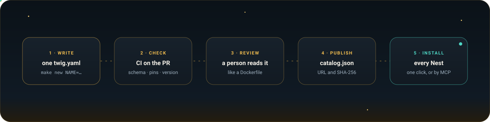

<p align="center">
  
</p>

<p align="center">
  <a href="https://github.com/twig-nest/twigs/actions/workflows/check.yml"></a>
  <a href="LICENSE"></a>
  <a href="CONTRIBUTING.md"></a>
  <a href="https://github.com/twig-nest"></a>
</p>

<p align="center">
The public catalog of <b>Twigs</b> for <a href="https://github.com/twig-nest">Twig Nest</a>, the platform that runs AI agents inside a team's own<br>
infrastructure to investigate, mitigate, and fix incidents. <b>A Twig teaches every Nest something new, as data.</b>
</p>

<br>

<table>
  <tr>
    <td width="25%" valign="top">
      <h4>🛠️ Tools</h4>
      A CLI installed into the images agents run in, from a pinned, checksummed download: <code>kubectl</code>,
      <code>aws</code>, <code>psql</code>, whatever your team reaches for.
    </td>
    <td width="25%" valign="top">
      <h4>🔑 Credential types</h4>
      How a kind of credential (a kubeconfig, an API key, an SSH key) reaches a Job, and the checks that prove it
      logs in and is read-only.
    </td>
    <td width="25%" valign="top">
      <h4>🧭 Hop kinds</h4>
      How a Job reaches a network: a TCP port, a tailnet, a WireGuard tunnel, a jump host, a private CA.
    </td>
    <td width="25%" valign="top">
      <h4>🤖 Agents</h4>
      An agent CLI that speaks the <a href="https://agentclientprotocol.com">Agent Client Protocol</a>: Claude Code, Codex,
      OpenCode, or the next one.
    </td>
  </tr>
</table>

Nothing is built into a Nest. Every Nest installs [`core`](twigs/core/twig.yaml) from this catalog at its first start, and an admin installs any other Twig from the Nest's **Twigs** page in one click, or asks their own agent to over MCP. No platform release is needed to add one, so the catalog grows with what teams use.

### Browse the catalog

Every Twig lives in [`twigs/<name>/twig.yaml`](twigs), and [`catalog.json`](catalog.json) indexes them all. The easiest way to explore is from a Nest: its Twigs page shows every Twig with what it provides, what it requires, and every command it runs, before you install it.

### How a Twig travels

<p align="center">
  
</p>

### Write one

```sh
make new NAME=mytool   # starts twigs/mytool/twig.yaml from a template
make check             # every check CI runs on a pull request
```

[CONTRIBUTING.md](CONTRIBUTING.md) walks through it, [docs/twig-format.md](docs/twig-format.md) describes every field, and [`schema/`](schema) holds the JSON Schemas the checks use. Editors with the YAML language server (VS Code's YAML extension, JetBrains IDEs, Neovim) validate and complete a `twig.yaml` as you type, through the `yaml-language-server` comment at its top.

### Use another catalog

A Nest reads [`catalog.json`](catalog.json), the index of every Twig with the URL and SHA-256 of its file, and installs a Twig only when the file still has that digest. A Nest reads this catalog by default. To use another, a fork or an internal mirror for a Nest that cannot reach GitHub, deploy the Nest with `TWIG_NEST_CATALOG_URL` set to its `catalog.json` (`nest.catalogURL` in the Helm chart), or set the Catalog URL in the console's Settings.

### Trust

A Twig's commands run on a team's Runners: a Tool's install step when an image is built, a Credential type's checks and a Hop kind's commands in Jobs. Every change is reviewed as you would review a Dockerfile ([docs/reviewing.md](docs/reviewing.md)), downloads are pinned by checksum, and a Nest shows an admin everything a Twig provides and every command it runs before it is installed. Report a vulnerability as [SECURITY.md](SECURITY.md) describes.

### License

[Apache-2.0](LICENSE). A Twig's `license` and each Tool's `notes` name the licenses of what it installs.

<br>

<p align="center">
  <picture>
    <source media="(prefers-color-scheme: dark)" srcset="docs/assets/twigs-wordmark.svg">
    
  </picture>
</p>
